# Architecture Documentation

## System Overview

The bookmarks application follows a client-server architecture with a clear separation between frontend and backend. The frontend is a Vue 3 Single Page Application (SPA) that communicates with a NestJS REST API backend. Data is persisted in a SQLite database using TypeORM.

## High-Level Architecture

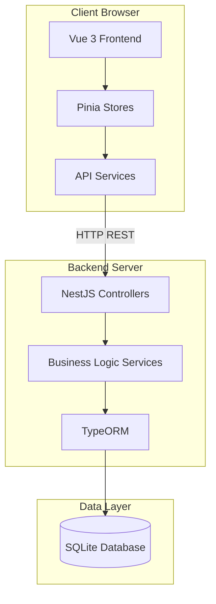

## Component Architecture

### Frontend Component Hierarchy

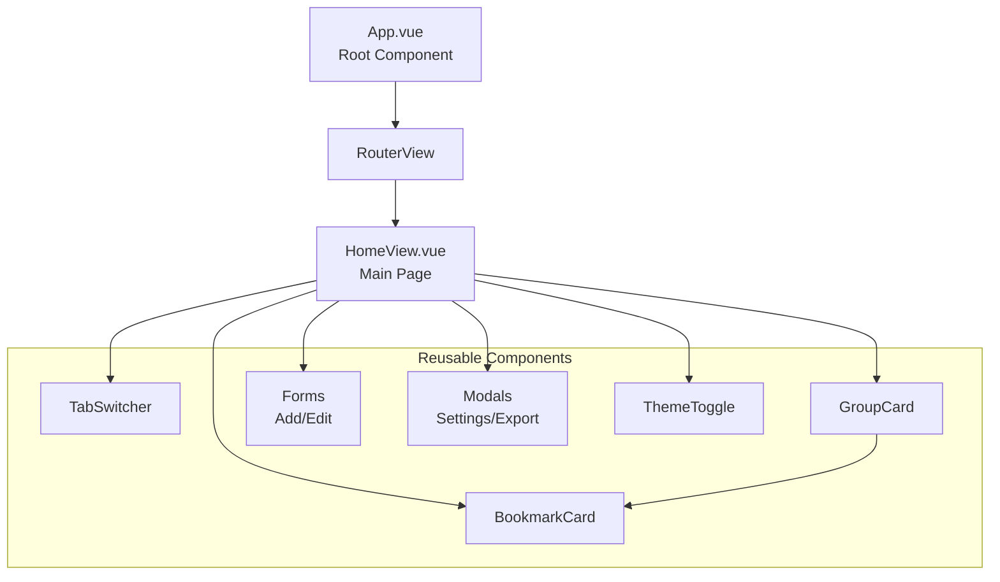

## Data Flow

### Creating a Bookmark

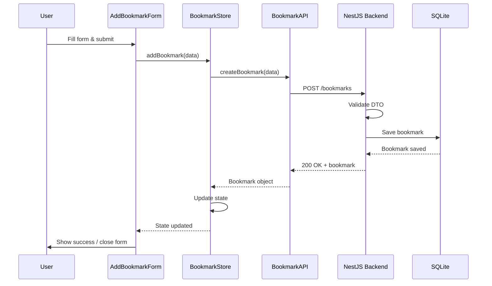

### Fetching Bookmarks

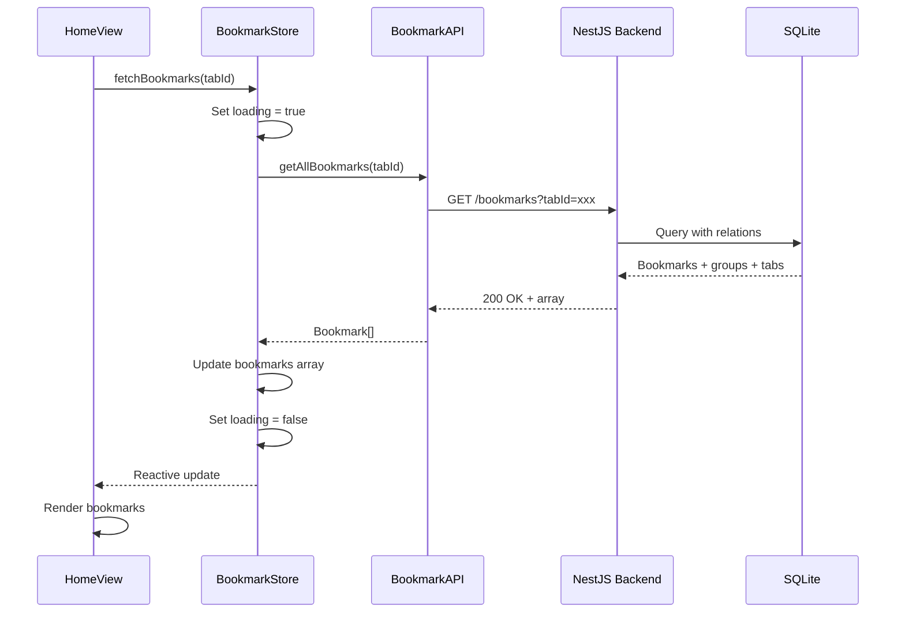

## State Management Flow

### Pinia Store Architecture

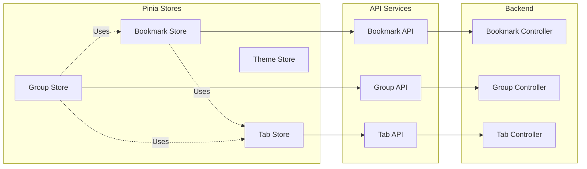

## Backend Architecture

### NestJS Module Structure

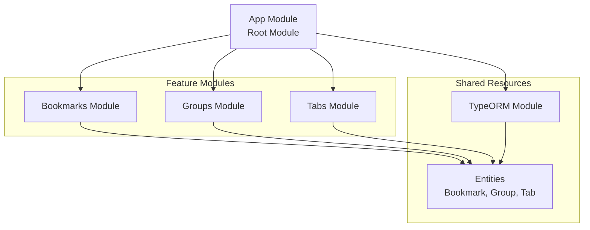

### Request Processing Flow

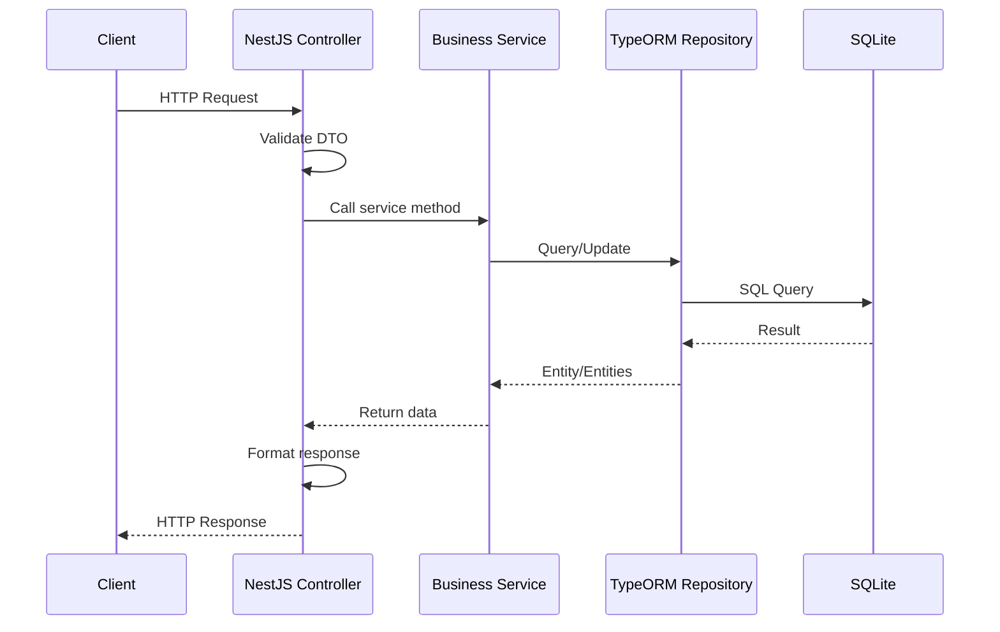

## Entity Relationships

### Database Relationships

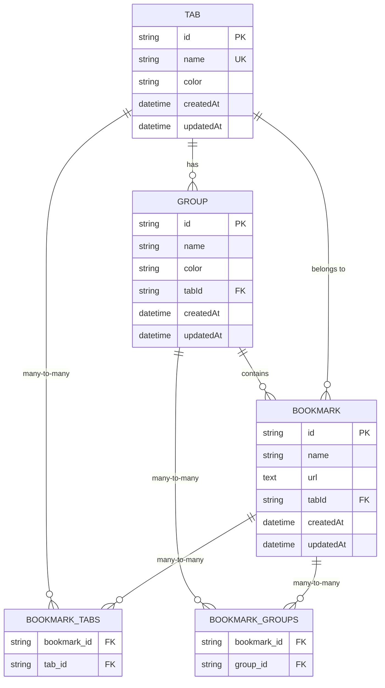

## API Service Pattern

### Factory Pattern for API Services

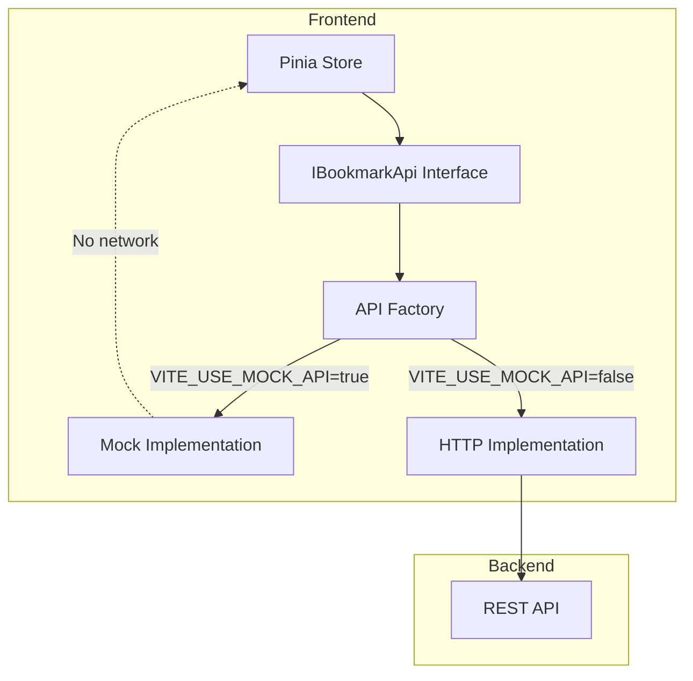

## Data Persistence

### TypeORM Configuration

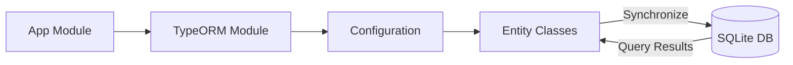

## Frontend-Backend Communication

### HTTP Request/Response Cycle

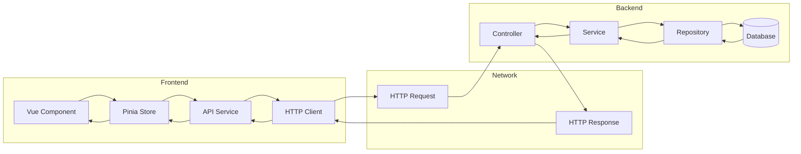

## Key Architectural Decisions

### 1. Separation of Concerns

- **Frontend**: Handles UI, user interactions, and client-side state
- **Backend**: Handles business logic, data validation, and persistence
- **Clear API Contract**: RESTful API with well-defined endpoints

### 2. State Management

- **Pinia Stores**: Centralized state management for each domain (bookmark, group, tab, theme)
- **Reactive Updates**: Vue's reactivity system ensures UI updates automatically
- **Computed Properties**: Derived state (filtered bookmarks, active tab) computed reactively

### 3. API Abstraction

- **Interface Pattern**: API services implement interfaces for testability
- **Mock/HTTP Switch**: Easy switching between mock and real API for development
- **Error Handling**: Consistent error handling across all API calls

### 4. Type Safety

- **TypeScript**: Full type coverage in both frontend and backend
- **DTOs**: Data Transfer Objects ensure type-safe API communication
- **Entity Types**: TypeORM entities provide database type safety

### 5. Validation

- **Client-Side**: Form validation in Vue components
- **Server-Side**: DTO validation using class-validator
- **URL Validation**: Custom validator for URL format

### 6. Database Design

- **SQLite**: Lightweight, file-based database for simplicity
- **TypeORM**: Object-Relational Mapping for type-safe database operations
- **Relationships**: Many-to-many and one-to-many relationships properly modeled
- **Cascade Deletion**: Automatic cleanup of related entities

## Scalability Considerations

### Current Architecture

- **Single Database**: SQLite file-based database
- **No Caching**: Direct database queries
- **No Authentication**: Public API access
- **Synchronous Operations**: All operations are synchronous

### Potential Improvements

1. **Database Migration**: PostgreSQL or MySQL for production
2. **Caching Layer**: Redis for frequently accessed data
3. **Authentication**: JWT-based authentication
4. **Pagination**: For large datasets
5. **Background Jobs**: For bulk operations
6. **API Rate Limiting**: To prevent abuse

## Deployment Architecture

### Development

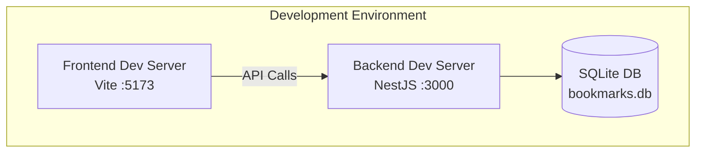

### Production (Docker)

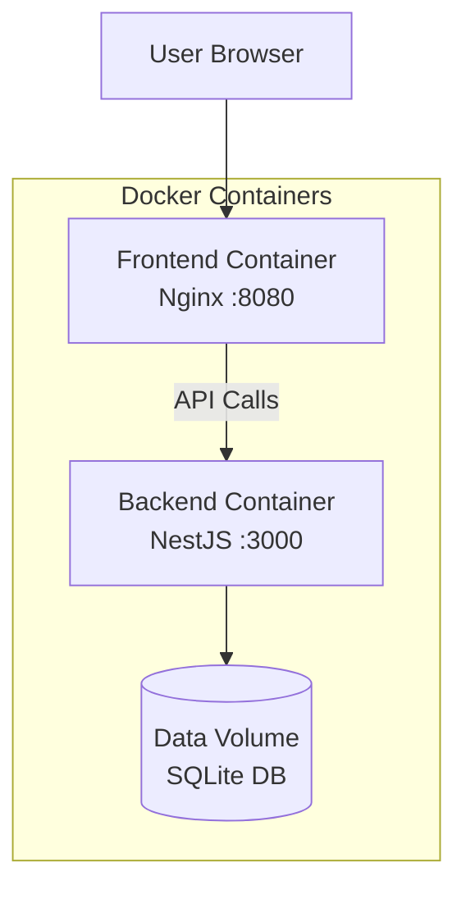

## Security Considerations

### Current State

- **CORS**: Configured to allow frontend origin
- **Input Validation**: DTO validation on all endpoints
- **No Authentication**: All endpoints are public

### Recommended Enhancements

1. **Authentication**: Implement JWT-based authentication
2. **Authorization**: Role-based access control
3. **HTTPS**: Encrypt all communications
4. **Input Sanitization**: Additional sanitization for user inputs
5. **Rate Limiting**: Prevent API abuse
6. **SQL Injection Prevention**: TypeORM provides protection, but additional validation recommended

## Testing Architecture

### Frontend Testing

- **Unit Tests**: Vitest for component and store testing
- **E2E Tests**: Playwright for end-to-end user workflows
- **Component Testing**: Storybook for visual component testing

### Backend Testing

- **Unit Tests**: Jest for service and controller testing
- **E2E Tests**: Supertest for API endpoint testing

## Error Handling Flow

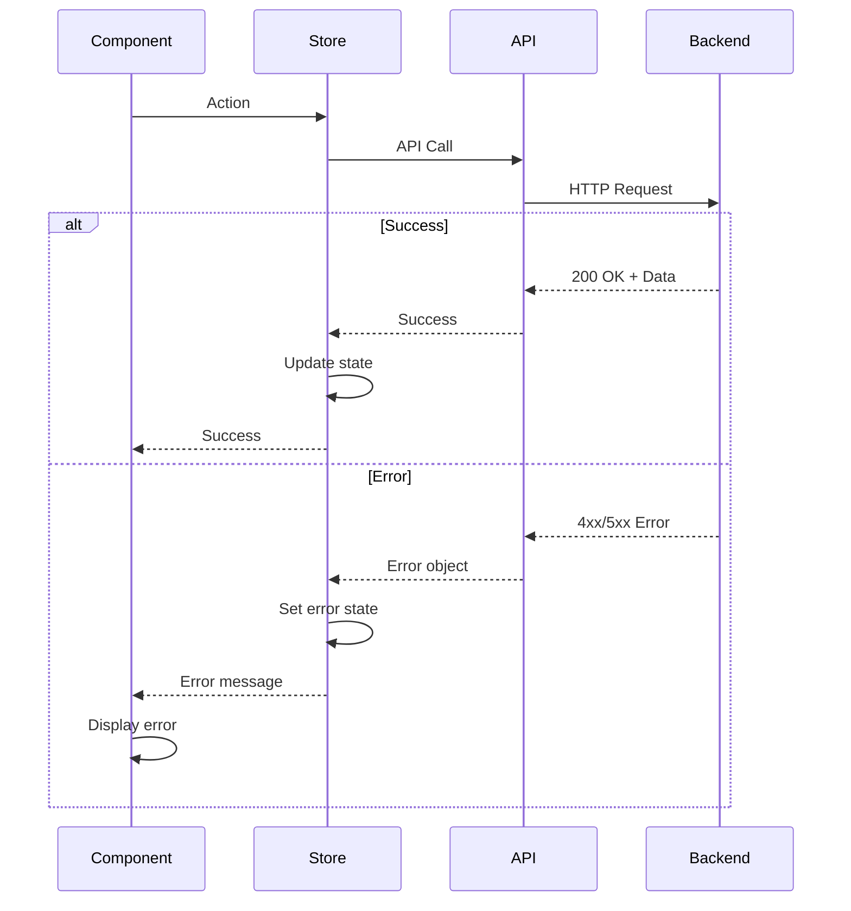

## Performance Considerations

1. **Lazy Loading**: Vue Router supports code splitting
2. **Reactive Updates**: Only affected components re-render
3. **Computed Properties**: Cached derived state
4. **Database Indexing**: TypeORM handles indexes for relationships
5. **No N+1 Queries**: TypeORM eager loading with relations
