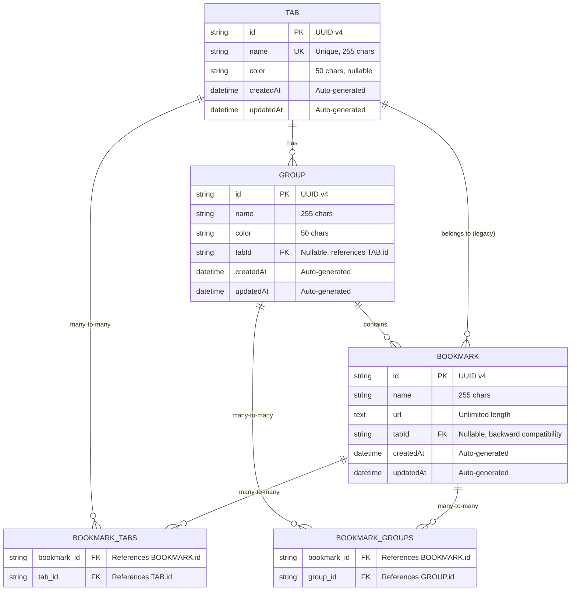

# Database Schema Documentation

## Overview

The bookmarks application uses SQLite as its database engine with TypeORM as the Object-Relational Mapping (ORM) framework. The database schema consists of three main entities (Bookmark, Group, Tab) and two junction tables for many-to-many relationships.

## Database Configuration

- **Database Engine**: SQLite 3
- **Database File**: `bookmarks.db` (default) or path specified in `DATABASE_PATH` environment variable
- **ORM**: TypeORM 0.3
- **Schema Synchronization**: Automatic in development (`synchronize: true`)

## Entity Relationship Diagram



## Tables

### `tabs` Table

The top-level organizational unit. Tabs represent major categories for organizing bookmarks.

**Columns**:

| Column | Type | Constraints | Description |
|--------|------|-------------|-------------|
| `id` | VARCHAR(36) | PRIMARY KEY | UUID v4 identifier |
| `name` | VARCHAR(255) | UNIQUE, NOT NULL | Tab name (must be unique) |
| `color` | VARCHAR(50) | NULL | Color code (hex format, e.g., `#3b82f6`) |
| `createdAt` | DATETIME | NOT NULL | Creation timestamp |
| `updatedAt` | DATETIME | NOT NULL | Last update timestamp |

**Indexes**:
- Primary key on `id`
- Unique index on `name`

**Relationships**:
- One-to-Many with `groups` (via `tabId`)
- Many-to-Many with `bookmarks` (via `bookmark_tabs` junction table)
- One-to-Many with `bookmarks` (via `tabId`, backward compatibility)

**Example Data**:
```sql
INSERT INTO tabs (id, name, color, createdAt, updatedAt) VALUES
('123e4567-e89b-12d3-a456-426614174000', 'Work', '#3b82f6', '2024-01-01 00:00:00', '2024-01-01 00:00:00');
```

### `groups` Table

Secondary organizational unit within tabs. Groups allow further categorization of bookmarks.

**Columns**:

| Column | Type | Constraints | Description |
|--------|------|-------------|-------------|
| `id` | VARCHAR(36) | PRIMARY KEY | UUID v4 identifier |
| `name` | VARCHAR(255) | NOT NULL | Group name |
| `color` | VARCHAR(50) | NOT NULL | Color code (hex format) |
| `tabId` | VARCHAR(36) | NULL, FK → `tabs.id` | Parent tab identifier |
| `createdAt` | DATETIME | NOT NULL | Creation timestamp |
| `updatedAt` | DATETIME | NOT NULL | Last update timestamp |

**Indexes**:
- Primary key on `id`
- Foreign key index on `tabId`

**Relationships**:
- Many-to-One with `tabs` (via `tabId`)
- Many-to-Many with `bookmarks` (via `bookmark_groups` junction table)

**Example Data**:
```sql
INSERT INTO groups (id, name, color, tabId, createdAt, updatedAt) VALUES
('223e4567-e89b-12d3-a456-426614174000', 'Frontend', '#ef4444', '123e4567-e89b-12d3-a456-426614174000', '2024-01-01 00:00:00', '2024-01-01 00:00:00');
```

### `bookmarks` Table

The core entity storing URL bookmarks with metadata.

**Columns**:

| Column | Type | Constraints | Description |
|--------|------|-------------|-------------|
| `id` | VARCHAR(36) | PRIMARY KEY | UUID v4 identifier |
| `name` | VARCHAR(255) | NOT NULL | Bookmark name |
| `url` | TEXT | NOT NULL | Bookmark URL (unlimited length) |
| `tabId` | VARCHAR(36) | NULL, FK → `tabs.id` | Legacy tab reference (backward compatibility) |
| `createdAt` | DATETIME | NOT NULL | Creation timestamp |
| `updatedAt` | DATETIME | NOT NULL | Last update timestamp |

**Indexes**:
- Primary key on `id`
- Foreign key index on `tabId`

**Relationships**:
- Many-to-Many with `tabs` (via `bookmark_tabs` junction table)
- Many-to-Many with `groups` (via `bookmark_groups` junction table)
- Many-to-One with `tabs` (via `tabId`, backward compatibility)

**Example Data**:
```sql
INSERT INTO bookmarks (id, name, url, tabId, createdAt, updatedAt) VALUES
('323e4567-e89b-12d3-a456-426614174000', 'Vue.js', 'https://vuejs.org', '123e4567-e89b-12d3-a456-426614174000', '2024-01-01 00:00:00', '2024-01-01 00:00:00');
```

### `bookmark_tabs` Junction Table

Junction table for the many-to-many relationship between bookmarks and tabs.

**Columns**:

| Column | Type | Constraints | Description |
|--------|------|-------------|-------------|
| `bookmark_id` | VARCHAR(36) | PRIMARY KEY, FK → `bookmarks.id` | Bookmark identifier |
| `tab_id` | VARCHAR(36) | PRIMARY KEY, FK → `tabs.id` | Tab identifier |

**Indexes**:
- Composite primary key on (`bookmark_id`, `tab_id`)
- Foreign key index on `bookmark_id`
- Foreign key index on `tab_id`

**Purpose**: Allows a bookmark to belong to multiple tabs.

**Example Data**:
```sql
INSERT INTO bookmark_tabs (bookmark_id, tab_id) VALUES
('323e4567-e89b-12d3-a456-426614174000', '123e4567-e89b-12d3-a456-426614174000');
```

### `bookmark_groups` Junction Table

Junction table for the many-to-many relationship between bookmarks and groups.

**Columns**:

| Column | Type | Constraints | Description |
|--------|------|-------------|-------------|
| `bookmark_id` | VARCHAR(36) | PRIMARY KEY, FK → `bookmarks.id` | Bookmark identifier |
| `group_id` | VARCHAR(36) | PRIMARY KEY, FK → `groups.id` | Group identifier |

**Indexes**:
- Composite primary key on (`bookmark_id`, `group_id`)
- Foreign key index on `bookmark_id`
- Foreign key index on `group_id`

**Purpose**: Allows a bookmark to belong to multiple groups.

**Example Data**:
```sql
INSERT INTO bookmark_groups (bookmark_id, group_id) VALUES
('323e4567-e89b-12d3-a456-426614174000', '223e4567-e89b-12d3-a456-426614174000');
```

## Relationships

### Tab → Group (One-to-Many)

- **Type**: One-to-Many
- **Implementation**: Foreign key `tabId` in `groups` table
- **Cardinality**: One tab can have many groups
- **Cascade**: Deleting a tab deletes all associated groups

### Tab → Bookmark (Many-to-Many)

- **Type**: Many-to-Many
- **Implementation**: Junction table `bookmark_tabs`
- **Cardinality**: 
  - One bookmark can belong to multiple tabs
  - One tab can contain multiple bookmarks
- **Cascade**: Deleting a tab removes all relationships in `bookmark_tabs`

### Tab → Bookmark (One-to-Many, Legacy)

- **Type**: One-to-Many (backward compatibility)
- **Implementation**: Foreign key `tabId` in `bookmarks` table
- **Purpose**: Maintained for backward compatibility with older versions
- **Note**: New implementations should use the many-to-many relationship via `bookmark_tabs`

### Group → Bookmark (Many-to-Many)

- **Type**: Many-to-Many
- **Implementation**: Junction table `bookmark_groups`
- **Cardinality**:
  - One bookmark can belong to multiple groups
  - One group can contain multiple bookmarks
- **Cascade**: Deleting a group removes all relationships in `bookmark_groups`

## TypeORM Entity Definitions

### Tab Entity

```typescript
@Entity('tabs')
export class Tab {
  @PrimaryColumn('varchar', { length: 36 })
  id: string;

  @Column('varchar', { length: 255, unique: true })
  name: string;

  @Column('varchar', { length: 50, nullable: true })
  color: string | null;

  @CreateDateColumn()
  createdAt: Date;

  @UpdateDateColumn()
  updatedAt: Date;
}
```

### Group Entity

```typescript
@Entity('groups')
export class Group {
  @PrimaryColumn('varchar', { length: 36 })
  id: string;

  @Column('varchar', { length: 255 })
  name: string;

  @Column('varchar', { length: 50 })
  color: string;

  @Column('varchar', { length: 36, nullable: true })
  tabId: string | null;

  @ManyToOne(() => Tab)
  @JoinColumn({ name: 'tabId' })
  tab: Tab;

  @ManyToMany(() => Bookmark, (bookmark) => bookmark.groups)
  bookmarks: Bookmark[];

  @CreateDateColumn()
  createdAt: Date;

  @UpdateDateColumn()
  updatedAt: Date;
}
```

### Bookmark Entity

```typescript
@Entity('bookmarks')
export class Bookmark {
  @PrimaryColumn('varchar', { length: 36 })
  id: string;

  @Column('varchar', { length: 255 })
  name: string;

  @Column('text')
  url: string;

  @Column('varchar', { length: 36, nullable: true })
  tabId: string | null; // Backward compatibility

  @ManyToOne(() => Tab, { nullable: true })
  @JoinColumn({ name: 'tabId' })
  tab: Tab;

  @ManyToMany(() => Tab)
  @JoinTable({
    name: 'bookmark_tabs',
    joinColumn: { name: 'bookmark_id', referencedColumnName: 'id' },
    inverseJoinColumn: { name: 'tab_id', referencedColumnName: 'id' },
  })
  tabs: Tab[];

  @ManyToMany(() => Group, (group) => group.bookmarks)
  @JoinTable({
    name: 'bookmark_groups',
    joinColumn: { name: 'bookmark_id', referencedColumnName: 'id' },
    inverseJoinColumn: { name: 'group_id', referencedColumnName: 'id' },
  })
  groups: Group[];

  @CreateDateColumn()
  createdAt: Date;

  @UpdateDateColumn()
  updatedAt: Date;
}
```

## Cascade Deletion Behavior

### Deleting a Tab

When a tab is deleted:

1. All groups with `tabId` matching the deleted tab are deleted
2. All bookmarks with `tabId` matching the deleted tab are deleted
3. All entries in `bookmark_tabs` with `tab_id` matching the deleted tab are removed
4. All entries in `bookmark_groups` for bookmarks being deleted are removed
5. The tab itself is deleted

**SQL Equivalent**:
```sql
-- Delete groups in tab
DELETE FROM groups WHERE tabId = 'tab-id';

-- Delete bookmarks in tab
DELETE FROM bookmarks WHERE tabId = 'tab-id';

-- Delete bookmark_tabs relationships
DELETE FROM bookmark_tabs WHERE tab_id = 'tab-id';

-- Delete bookmark_groups relationships (via bookmarks)
DELETE FROM bookmark_groups WHERE bookmark_id IN (
  SELECT id FROM bookmarks WHERE tabId = 'tab-id'
);

-- Delete the tab
DELETE FROM tabs WHERE id = 'tab-id';
```

### Deleting a Group

When a group is deleted:

1. All entries in `bookmark_groups` with `group_id` matching the deleted group are removed
2. The group itself is deleted
3. **Bookmarks are NOT deleted** - they become ungrouped

**SQL Equivalent**:
```sql
-- Delete bookmark_groups relationships
DELETE FROM bookmark_groups WHERE group_id = 'group-id';

-- Delete the group
DELETE FROM groups WHERE id = 'group-id';
```

### Deleting a Bookmark

When a bookmark is deleted:

1. All entries in `bookmark_tabs` with `bookmark_id` matching the deleted bookmark are removed
2. All entries in `bookmark_groups` with `bookmark_id` matching the deleted bookmark are removed
3. The bookmark itself is deleted

**SQL Equivalent**:
```sql
-- Delete bookmark_tabs relationships
DELETE FROM bookmark_tabs WHERE bookmark_id = 'bookmark-id';

-- Delete bookmark_groups relationships
DELETE FROM bookmark_groups WHERE bookmark_id = 'bookmark-id';

-- Delete the bookmark
DELETE FROM bookmarks WHERE id = 'bookmark-id';
```

## Query Examples

### Get All Bookmarks with Relations

```typescript
const bookmarks = await bookmarkRepository.find({
  relations: ['groups', 'tabs'],
});
```

**SQL Generated**:
```sql
SELECT 
  bookmark.*,
  groups.*,
  tabs.*
FROM bookmarks bookmark
LEFT JOIN bookmark_groups ON bookmark.id = bookmark_groups.bookmark_id
LEFT JOIN groups ON bookmark_groups.group_id = groups.id
LEFT JOIN bookmark_tabs ON bookmark.id = bookmark_tabs.bookmark_id
LEFT JOIN tabs ON bookmark_tabs.tab_id = tabs.id
```

### Get Bookmarks for a Specific Tab

```typescript
const bookmarks = await bookmarkRepository
  .createQueryBuilder('bookmark')
  .leftJoinAndSelect('bookmark.groups', 'groups')
  .leftJoinAndSelect('bookmark.tabs', 'tabs')
  .where('bookmark.tabId = :tabId OR tabs.id = :tabId', { tabId })
  .getMany();
```

**SQL Generated**:
```sql
SELECT 
  bookmark.*,
  groups.*,
  tabs.*
FROM bookmarks bookmark
LEFT JOIN bookmark_groups ON bookmark.id = bookmark_groups.bookmark_id
LEFT JOIN groups ON bookmark_groups.group_id = groups.id
LEFT JOIN bookmark_tabs ON bookmark.id = bookmark_tabs.bookmark_id
LEFT JOIN tabs ON bookmark_tabs.tab_id = tabs.id
WHERE bookmark.tabId = ? OR tabs.id = ?
```

### Get Groups for a Specific Tab

```typescript
const groups = await groupRepository.find({
  where: { tabId },
  relations: ['bookmarks'],
});
```

**SQL Generated**:
```sql
SELECT groups.*, bookmarks.*
FROM groups
LEFT JOIN bookmark_groups ON groups.id = bookmark_groups.group_id
LEFT JOIN bookmarks ON bookmark_groups.bookmark_id = bookmarks.id
WHERE groups.tabId = ?
```

## Database Maintenance

### Backup

```bash
# Copy the database file
cp bookmarks.db bookmarks.db.backup

# Or use SQLite backup command
sqlite3 bookmarks.db ".backup 'bookmarks.db.backup'"
```

### Restore

```bash
# Copy backup file
cp bookmarks.db.backup bookmarks.db

# Or restore from backup
sqlite3 bookmarks.db < backup.sql
```

### Vacuum (Optimize)

```bash
sqlite3 bookmarks.db "VACUUM;"
```

### Check Database Integrity

```bash
sqlite3 bookmarks.db "PRAGMA integrity_check;"
```

## Migration Considerations

### Current State

- **Development**: Uses `synchronize: true` for automatic schema updates
- **Production**: Should use migrations instead of `synchronize: true`

### Recommended Migration Strategy

1. **Disable Synchronize**: Set `synchronize: false` in production
2. **Use Migrations**: Generate and run TypeORM migrations
3. **Version Control**: Track migration files in version control
4. **Backup Before Migration**: Always backup database before running migrations

### Example Migration

```typescript
// Example migration to add an index
export class AddBookmarkUrlIndex1234567890 implements MigrationInterface {
  public async up(queryRunner: QueryRunner): Promise<void> {
    await queryRunner.createIndex('bookmarks', new TableIndex({
      name: 'IDX_BOOKMARK_URL',
      columnNames: ['url'],
    }));
  }

  public async down(queryRunner: QueryRunner): Promise<void> {
    await queryRunner.dropIndex('bookmarks', 'IDX_BOOKMARK_URL');
  }
}
```

## Performance Considerations

### Indexes

Current indexes:
- Primary keys (automatic)
- Foreign keys (automatic)
- Unique constraint on `tabs.name`

**Potential Additional Indexes**:
- Index on `bookmarks.url` for URL searches
- Index on `bookmarks.createdAt` for date-based queries
- Composite index on `(tabId, createdAt)` for filtered date queries

### Query Optimization

1. **Use Relations Sparingly**: Only load relations when needed
2. **Pagination**: Implement pagination for large datasets
3. **Select Specific Fields**: Use `select` to limit returned columns
4. **Batch Operations**: Use transactions for multiple related operations

## Data Types

### UUID Format

All IDs use UUID v4 format:
- **Length**: 36 characters (32 hex + 4 hyphens)
- **Example**: `123e4567-e89b-12d3-a456-426614174000`
- **Generation**: Using `uuid` npm package (`v4 as uuidv4`)

### Timestamps

- **Format**: ISO 8601 (e.g., `2024-01-01T00:00:00.000Z`)
- **Type**: DATETIME in SQLite
- **Auto-generation**: Handled by TypeORM `@CreateDateColumn()` and `@UpdateDateColumn()`

### Color Format

- **Format**: Hex color code (e.g., `#3b82f6`)
- **Length**: Up to 50 characters (allows for color names if needed)
- **Validation**: Client-side validation, no database constraint

## Constraints and Validation

### Database Constraints

1. **Primary Keys**: All tables have UUID primary keys
2. **Unique Constraint**: `tabs.name` must be unique
3. **Foreign Keys**: Enforced by TypeORM (SQLite doesn't enforce by default)
4. **NOT NULL**: Applied to required fields

### Application-Level Validation

1. **URL Validation**: Custom validator ensures valid URL format
2. **String Length**: Enforced by DTOs and entity definitions
3. **Required Fields**: Validated by class-validator decorators
